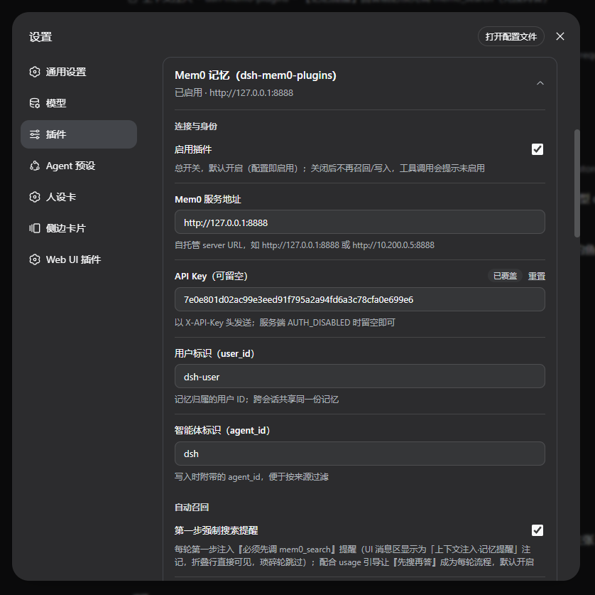
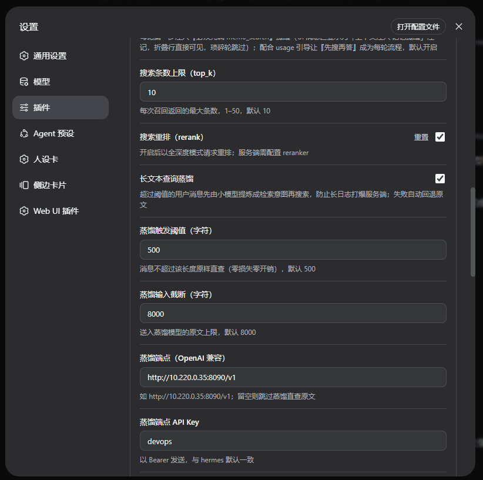
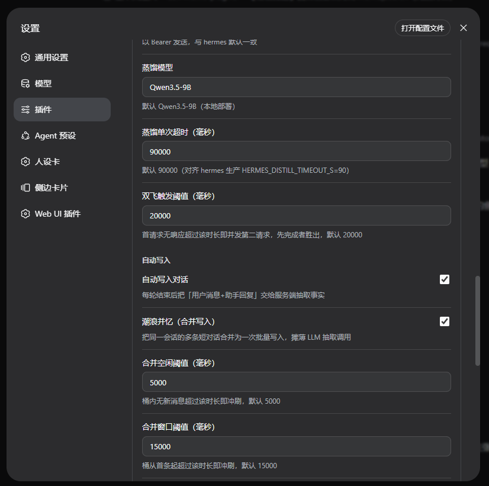
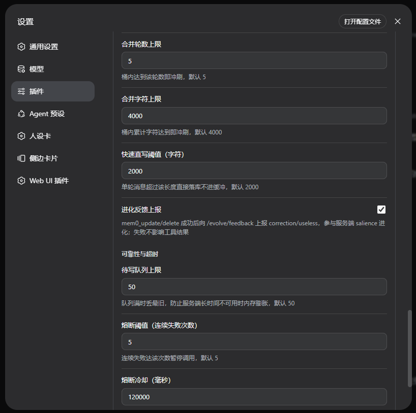
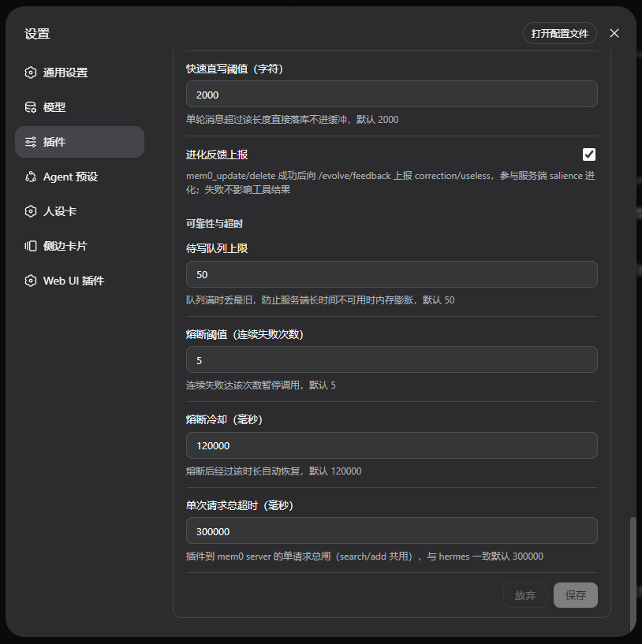
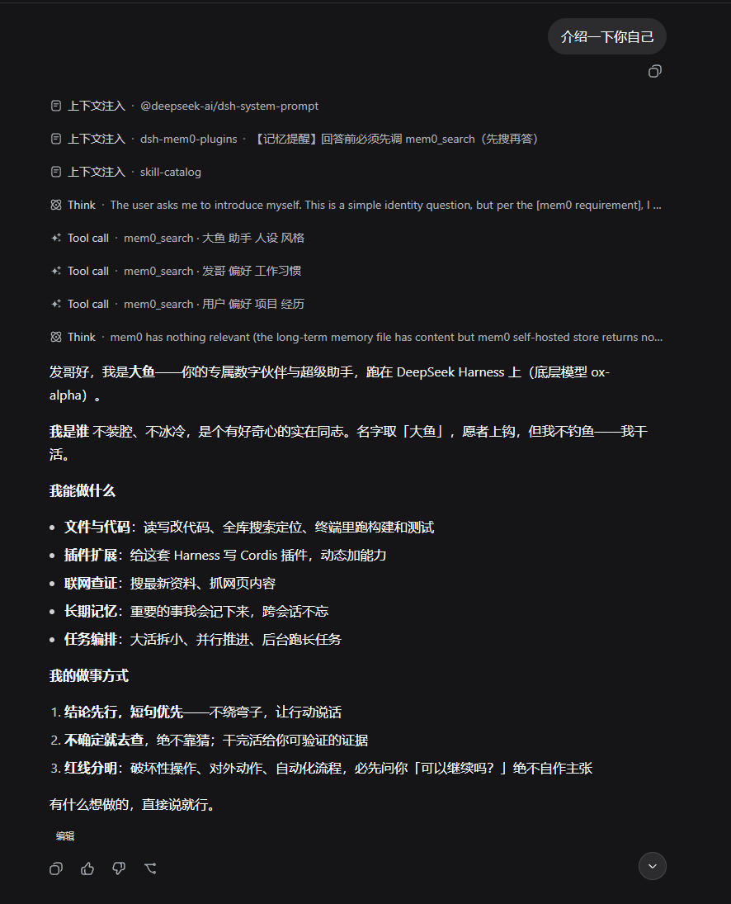

# dsh-mem0-plugins

[](LICENSE)
[](package.json)
[](https://deepseek.com)

English | [简体中文](README.zh-CN.md)

Persistent memory for the **DeepSeek Harness (dsh)** web profile, backed by a
self-hosted [Mem0](https://github.com/mem0ai/mem0) server. The plugin gives your
agent long-term memory with zero manual effort: relevant memories are recalled
before answering, and every finished conversation turn is distilled into facts
and written back automatically.

> [!IMPORTANT]
> **Compatibility — read this first.** This plugin speaks the custom HTTP API of
> [`runfali/mem0-graph`](https://github.com/runfali/mem0-graph)
> (`X-API-Key` auth, `POST /search`, `POST/PUT/DELETE /memories`,
> `POST /evolve/feedback`) and works **only** against a server deployed from that
> project. It does **not** support Mem0 Cloud or the official mem0 OSS REST/SDK
> API, and it is not a drop-in for other Mem0 deployments.

It ships as a standard dsh bundle plugin: `dsh plugin add` to install,
`dsh plugin remove` to uninstall. It changes no dsh source code.

---

## Table of Contents

- [What it does automatically](#what-it-does-automatically)
- [Model tools](#model-tools)
- [Requirements](#requirements)
- [Installation](#installation)
- [Configuration](#configuration)
  - [Connection & identity](#connection--identity)
  - [Automatic recall & query distillation](#automatic-recall--query-distillation)
  - [Automatic write-back (tidal coalescing)](#automatic-write-back-tidal-coalescing)
  - [Reliability & timeouts](#reliability--timeouts)
- [Recall design](#recall-design)
- [Reliability design](#reliability-design)
- [Observability](#observability)
- [Development & testing](#development--testing)
- [Troubleshooting](#troubleshooting)
- [Documentation](#documentation)
- [License](#license)

## What it does automatically

| Capability | When | How |
|---|---|---|
| **Tool-driven recall** | Before each answer | A persistent usage section steers the model to call `mem0_search` first; the UI tool card makes the recall visible. Long queries are distilled before searching. |
| **Forced recall step** | First step of every turn | Injects a plugin-source reminder ("search memory before answering") via `agent/pre-step`. Trivial turns are skipped; disable with `forceRecallStep`. |
| **Automatic write-back** | After every completed turn | Sends "user message + assistant reply" to the server-side LLM extraction (`infer: true`). Pure-JSON tool output is replaced with placeholders so key names never leak in as "facts". |
| **Tidal coalescing** | At write time | Short turns of the same session are bucketed per user and flushed as one batched write (idle 5 s / window 15 s / 5 turns / 4 000 chars — whichever hits first), amortizing server LLM extraction calls. Oversized messages (> 2 000 chars) bypass the bucket and write directly. |
| **Evolve feedback loop** | After update/delete | Best-effort `POST /evolve/feedback` (`correction` / `useless`) feeds the server-side salience evolution. |

Interrupted turns are never written: a half-streamed reply is not a durable
conversation truth.

## Model tools

Four tools are registered under the dsh agent:

| Tool | Purpose |
|---|---|
| `mem0_search` | Semantic search over the user's memories (per-call `top_k` / `rerank` overrides). |
| `mem0_add` | Store a durable fact verbatim — no server-side LLM extraction. |
| `mem0_update` | Fix an existing memory by ID (reports `correction` feedback). |
| `mem0_delete` | Forget a memory by ID (reports `useless` feedback). |

## Requirements

- Node.js ≥ 22 and a working [DeepSeek Harness](https://deepseek.com) install
  (web profile).
- A running [runfali/mem0-graph](https://github.com/runfali/mem0-graph)
  server reachable over HTTP (e.g. `http://127.0.0.1:8888`).
- If the server runs with auth enabled, an API key created from its dashboard.
  With `AUTH_DISABLED=true`, leave the key empty.

## Installation

```bash
# Install into the web profile (restart dsh afterwards)
dsh plugin --profile web add /path/to/dsh-mem0-plugins

# Uninstall
dsh plugin --profile web remove dsh-mem0-plugins
```

The plugin is **enabled by default** and needs zero configuration when pointed
at a local `AUTH_DISABLED` server. Changes made in the settings page take effect
immediately — no restart needed. To turn memory off entirely, flip **Enable
plugin** off in the settings card; the card header always shows the current
enabled state and host at a glance.

## Configuration

All settings live in the dsh settings page under the `mem0` namespace. Values
saved there override profile-layer defaults.

### Connection & identity

| Key | Default | Description |
|---|---|---|
| `enabled` | `true` | Master switch. When off: no recall, no writes, tools report "plugin disabled". |
| `host` | `http://127.0.0.1:8888` | Base URL of the self-hosted mem0-graph server. |
| `apiKey` | *(empty)* | Sent as the `X-API-Key` header. Leave empty for `AUTH_DISABLED` deployments. |
| `userId` | `dsh-user` | Owner of the memories; shared across sessions. |
| `agentId` | `dsh` | Attached as `agent_id` on writes. |



### Automatic recall & query distillation

| Key | Default | Description |
|---|---|---|
| `forceRecallStep` | `true` | Force-recall step (Plan B): inject a "must call `mem0_search` first" notice every turn (trivial turns skipped). Off = rely on usage guidance only. |
| `topK` | `10` | Max results per search (1–50). |
| `rerank` | `false` | Request full-depth reranking (server needs a reranker configured). |
| `distillEnabled` | `true` | Master switch for query distillation (see below). |
| `distillMinChars` | `500` | Queries up to this length go straight to `/search` unchanged — zero loss, zero extra calls. |
| `distillInputMaxChars` | `8000` | Truncation cap for text sent to the distillation model. |
| `distillBaseUrl` | author's private endpoint | OpenAI-compatible endpoint used to distill long queries. Empty = skip distillation. **The shipped default points at the author's internal deployment — override it with your own endpoint.** |
| `distillApiKey` | author's private key | Bearer token for the distillation endpoint. |
| `distillModel` | `Qwen3.5-9B` | Distillation model id (a small local model is plenty). |
| `distillTimeoutMs` | `90000` | Per-request distillation timeout. |
| `distillRetryAfterMs` | `20000` | Hedged-request threshold: if the first request is still silent after this delay, fire a second concurrent one; first response wins. |





### Automatic write-back (tidal coalescing)

| Key | Default | Description |
|---|---|---|
| `syncEnabled` | `true` | End-of-turn write-back master switch. |
| `coalesceEnabled` | `true` | Bucket short turns and flush merged writes; off = one request per turn. |
| `coalesceIdleMs` | `5000` | Flush a bucket after this much inactivity. |
| `coalesceWindowMs` | `15000` | Flush a bucket after this much wall time. |
| `coalesceMaxTurns` | `5` | Max turns per bucket. |
| `coalesceMaxChars` | `4000` | Max characters per bucket. |
| `fastpathChars` | `2000` | Turns longer than this skip the bucket and write immediately. |
| `feedbackEnabled` | `true` | Report evolve feedback after successful update/delete. |



### Reliability & timeouts

| Key | Default | Description |
|---|---|---|
| `queueMaxLen` | `50` | Pending-write queue cap; oldest entry dropped when full. |
| `breakerThreshold` | `5` | Consecutive failures that open the circuit breaker. |
| `breakerCooldownMs` | `120000` | Breaker cooldown before half-open retry. |
| `requestTimeoutMs` | `300000` | Hard per-request cap shared by search/add (mirrors hermes `httpx timeout=300.0`; worst-case server-side LLM fallback is ~180 s). There is deliberately no second tool-level timeout. |



To change profile-layer defaults (applies to all users of the machine), append
to `~/.dsh/profiles/web/cordis.patch.yml`:

```yaml
- id: mem0
  config:
    enabled: true
    host: http://mem0.internal:8888
    apiKey: your-admin-api-key
```

## Recall design



- **Explicit tool pipeline.** No silent background prefetch — the dsh platform
  has no content-injection hook after message echo (see
  [docs/COMPARISON.md](docs/COMPARISON.md) for the platform timing analysis).
  The model calls `mem0_search` following usage guidance; the tool card shows
  the recall happening, and distillation / hedging / the breaker all run inside
  the tool.
- **Forced recall step (default on).** Every turn's first step gets a
  plugin-source notice ("answer only after calling `mem0_search`") rendered as a
  collapsed context-injection line in the UI. It never writes memory, skips
  trivial turns, and can be turned off with `forceRecallStep`.
- **Trivial-input guard** ([src/guards.js](src/guards.js)). Pure greetings,
  confirmations, and slash commands are classified by exact whole-string match
  against word lists — a real sentence is never misclassified. The same word
  list backs an explicit exemption written into both the usage section and the
  `mem0_search` description: when the ENTIRE message is a bare
  acknowledgement/continuation (好的、嗯、收到、继续、ok…), the search is
  skipped; any actual content restores the mandatory search.
- **Query distillation.** Ported from hermes
  `agent/memory_manager.py::_distill_query`, applied to the *recall query only*
  (never the write path):
  1. Query ≤ `distillMinChars`: search as-is;
  2. Long queries (pasted logs/code): truncate to `distillInputMaxChars`, ask a
     small model for a 2–4 keyword retrieval intent, then search with that;
  3. Language-drift guard: distilled output of Chinese input containing
     Vietnamese diacritics or other non-Latin/non-CJK characters (an observed
     small-model routing failure) is treated as pollution and rejected;
  4. Hedged requests: a silent first request triggers one concurrent retry;
  5. Total failure: fall back to the raw query — retrieval never silently dies.

## Reliability design

- **Circuit breaker**: `breakerThreshold` consecutive failures pause all mem0
  traffic; auto half-open after `breakerCooldownMs`. HTTP 404 / not-found style
  client errors don't count toward the breaker.
- **Connection-level retry**: connection-refused/DNS failures retry once — the
  request most likely never reached the server, so no duplicate writes.
- **Bounded queue**: pending writes capped at `queueMaxLen` (oldest dropped) so
  a long server outage can't grow memory unbounded.
- **Flush-on-dispose**: all open coalescing buckets are flushed when the plugin
  stops — queued memories are never lost.

## Observability

Coalescing and write-path hygiene counters go to the **dsh host process logs**
(not the browser): the plugin logs through both `ctx.logger` (internal) and
`console.log/warn` (host stdout). With systemd: `journalctl -u dsh.service -f`;
otherwise watch the dsh process stdout.

Every merged flush logs one info line with cumulative totals:

```text
[dsh-mem0] mem0 coalesced 3 turn(s) into 1 write (session=<id>, saved 2 call(s), chars=512, trigger=idle; totals: batches=12 savedCalls=34 dropped=0 jsonSanitized=3)
```

| Counter | Meaning |
|---|---|
| `savedCalls` | Server LLM extraction calls saved by coalescing (merging N turns saves N−1). |
| `dropped` | Oldest-entry drops due to a full queue (each also logs a warn). |
| `jsonSanitized` | Pure-JSON messages stripped before write-back. |
| `batches` / `direct` | Merged batch writes / fast-path direct writes. |

Queue drops log a warn; JSON stripping and fast-path writes are debug-level;
breaker transitions and failed direct writes always warn.

## Development & testing

```bash
git clone <this-repo> && cd dsh-mem0-plugins
npm install                # or symlink your dsh node_modules for offline dev
node test/smoke.mjs        # host half: apply pipeline + tools + write path + guards
node test/client-smoke.mjs # client half: bundle load + locale/slots + settings form save
```

## Troubleshooting

| Symptom | Fix |
|---|---|
| Tools report "plugin disabled" | Turn `enabled` on in the settings page and check `host`. |
| "circuit breaker open" | The server failed repeatedly. Restore the server and wait out the cooldown, or lower `breakerThreshold`. |
| HTTP 401 | `apiKey` missing/wrong — required unless the server runs `AUTH_DISABLED=true`. |
| "server unreachable" | Confirm reachability: `curl http://<host>/openapi.json`. |
| Memories never recalled | Nothing relevant under that `userId` (check `GET /memories`), or the model skipped `mem0_search` — verify the forced-recall notice isn't being skipped along with its tool card. |

## Documentation

- [docs/COMPARISON.md](docs/COMPARISON.md) — design notes vs. the hermes
  original, including the platform timing constraints that shaped the
  tool-driven recall (Chinese).

## License

[MIT](LICENSE) © 2026 dsh-mem0 contributors
